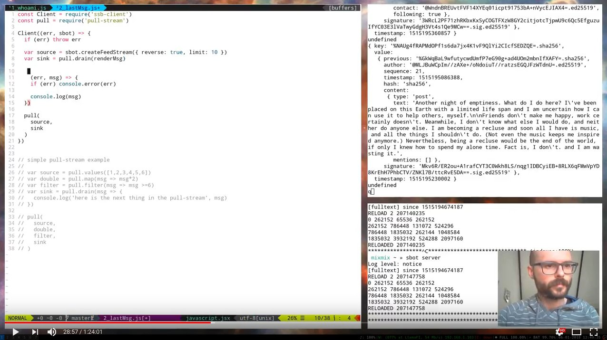

# Intro to Scuttlebutt: ssb-client

Part of a series of tutorials being collected into the [scuttlebutt-guide](https://github.com/ssbc/scuttlebutt-guide)

The aim of this code is to provide some examples about how to use `ssb-client`. We cover:
- setting up a scuttlebot
- where does `ssb-client` fit in the ecosystem ([1:00](https://youtu.be/D9A06DhQ8aw?t=60))
- connecting to scuttlbot, and running: 
  - `whoami` ([10:32](https://youtu.be/D9A06DhQ8aw?t=632))
  - `createFeedStream` ([26:18](https://youtu.be/D9A06DhQ8aw?t=1578))
  - `createUserStream` ([48:27](https://youtu.be/D9A06DhQ8aw?t=2907))
- basics of pull-streams ([16:41](https://youtu.be/D9A06DhQ8aw?t=1001))

_This code assumes you already have content in your ssb database (from using Patchwork or similar)_

Here's a recording of the twitch stream that generated this.
https://youtu.be/D9A06DhQ8aw

Use the timestamp links above to look for certain topics in context. There's a summary of where we go to with the final js file (#4) at [1:17:46](https://youtu.be/D9A06DhQ8aw?t=4661)

## Links

- [scuttlebutt-guide](https://github.com/ssbc/scuttlebutt-guide) - all the resources!
- [scuttelbutt.nz](https://scuttlebutt.nz) - get started with a scuttlebutt app like Patchwork (this will mean you have lots of juicy data to play with)
- pull-streams
  - [pull-stream.github.io](https://pull-stream.github.io/) - pull-stream module aggreration
  - [github.com/pull-stream/pull-stream-faq](https://github.com/pull-stream/pull-stream-faq) - answers to common questions. Nice place to start to learn more difficult things.
- sbot api
  - [createFeedStream](http://scuttlebot.io/apis/scuttlebot/ssb.html#createfeedstream-source)
  - [createUserStream](http://scuttlebot.io/apis/scuttlebot/ssb.html#createuserstream-source)

## Feedback

I'm still learning - learning about how to weave scuttle code, and learning about how to introduce others to it.

If you have aternative solutions you'd like to share, or feedback on the method or format, I'd love to hear.

You can find me scuttlebutt : `@ye+QM09iPcDJD6YvQYjoQc7sLF/IFhmNbEqgdzQo3lQ=.ed25519`
or on twitter : [@whimful](https://www.twitter.com/whimful)

## Hiring p2p Developers

If you're interested in having a p2p application built, please get in touch. You can hire our [tech coop](https://www.protozoa.nz) and am happy to route you to excellent humans in the community 
